# Peristaltic Doser System - Rust Implementation

## Overview
This project provides a high-precision stepper motor dosing system with IoT capabilities. Built entirely in Rust, it features a hardware-agnostic controller with web interface and a hardware-specific agent for motor control.

## Features
- **🎯 Sub-milliliter** precision dosing control
- **🌐 Web-based GUI** using Leptos WASM framework
- **🤖 MQTT integration** for IoT ecosystems
- **⚙️ Hardware abstraction** for cross-platform development
- **📊 Real-time monitoring** and event logging
- **🔧 Multi-point pump calibration**

## Hardware Requirements
- **Controller**: raspbery pi 2W,3,4,5
- **Stepper Motor Driver**: [BIGTREETECH MKS-Servo42C](https://github.com/makerbase-mks/MKS-SERVO42C) with UART control for precise motor management.
- **Power Supply**: Suitable power source for the raspbery pi SBC and stepper motor driver.
- **Peristaltic Pump**: DIY or commercially available peristaltic pump compatible with the stepper motor.
- **Miscellaneous**: Cables, connectors, and mounting hardware as needed for your specific setup.

## Architectue
- **Controller**: Main rust application with Web Server and Letpos WASM Web GUI, responsible for dosing calculation and scheculing, integration with IoT over MQTT/RestAPI/Notifications.
- **Agent**: Driver for integration with hardware

# Architecture

## System Overview
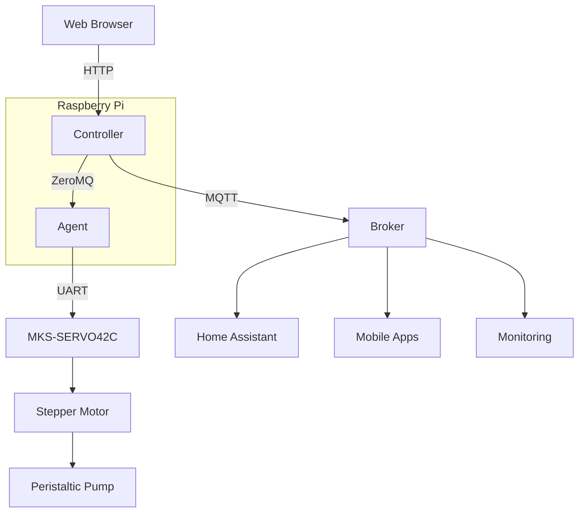

## Component Structure
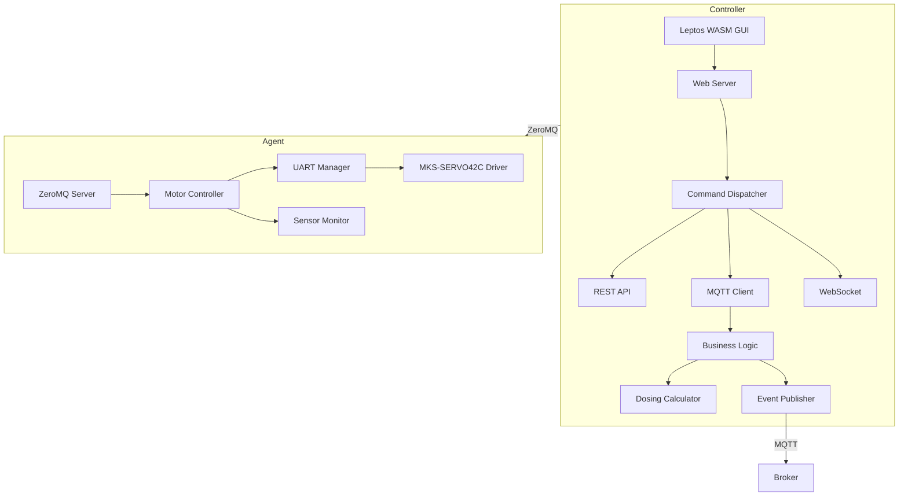

## Communication Flow
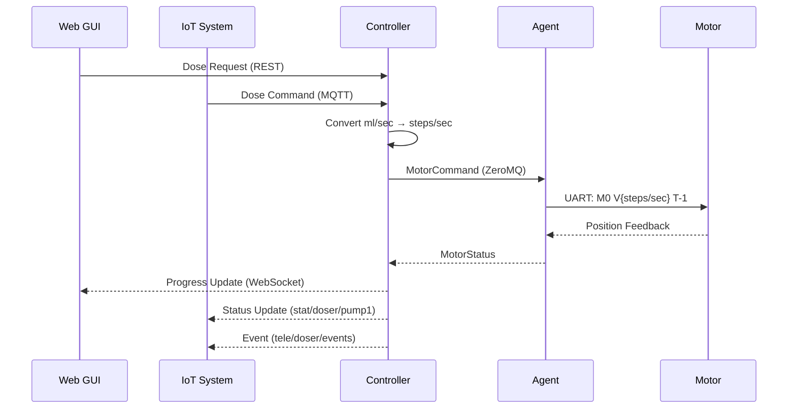

## Core dependencies
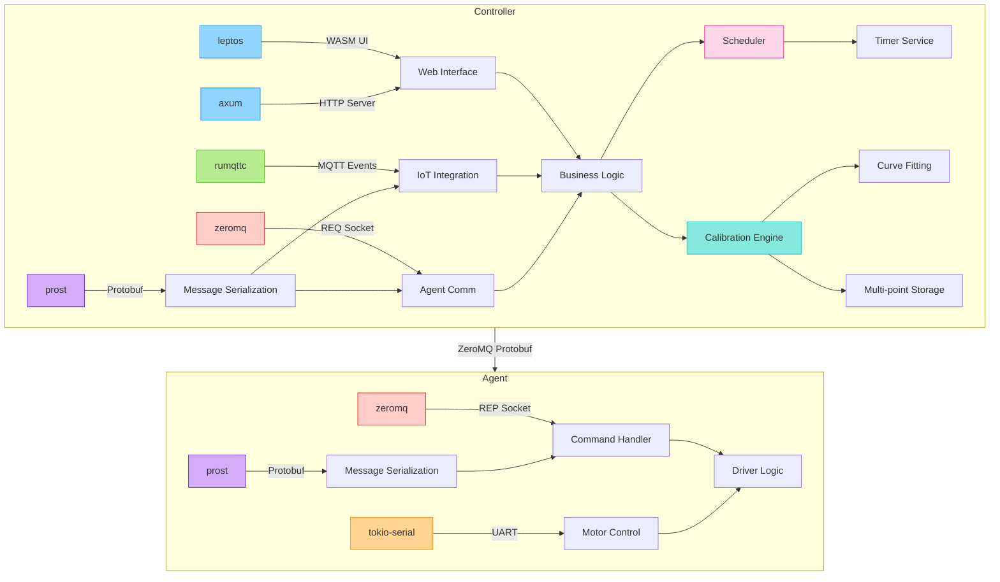

# MQTT Integration
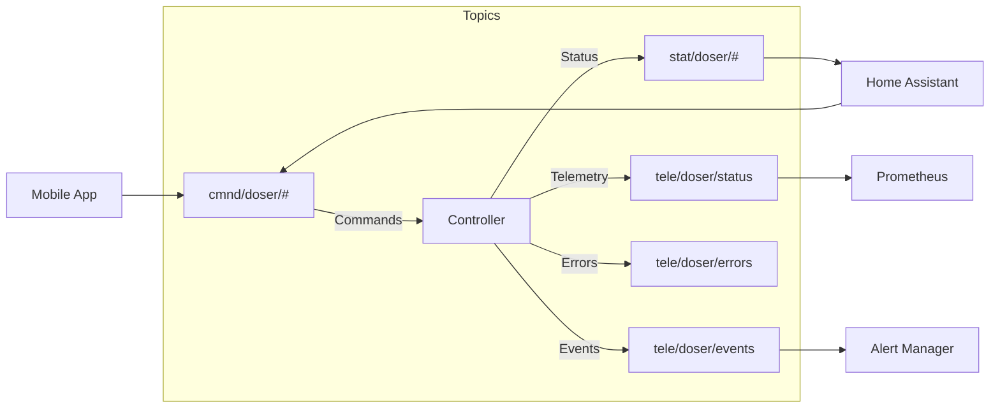

# MQTT Topic Structure:

| Topic  	                              | Direction  | Payload                                        | QoS |
|---	                                  |---	       |---	                                            |---	|
| < doser-id >/cmd/< pump-id >/dose   	| In         | {"volume_ml":50.0,"duration":2.5, "direction"} | 1  	|
| < doser-id >/stat/< pump-id >/status  | Out  	     | {"state":"running"}	                          | 1  	|
| < doser-id >/events  	                | Out  	     | {"event":"dosing_complete","pump-id": 1}  	    | 0  	|
| < doser-id >/errors  	                | Out  	     | {"code":"E102","msg":"Motor stalled"}          | 2  	|

# Scheduling Architecture
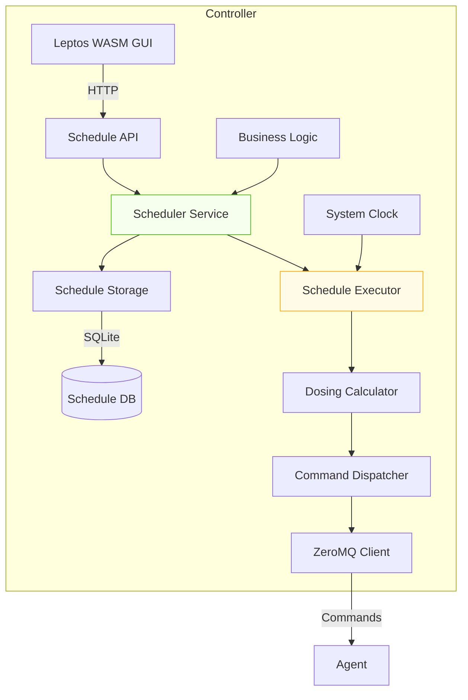

## Scheduling Key Components

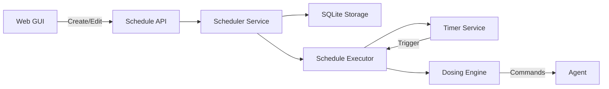

## Scheduling Workflow
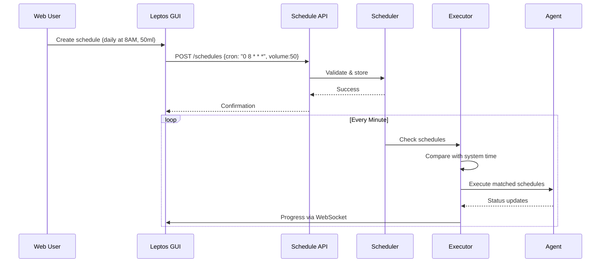

## Schedule Storage Schema

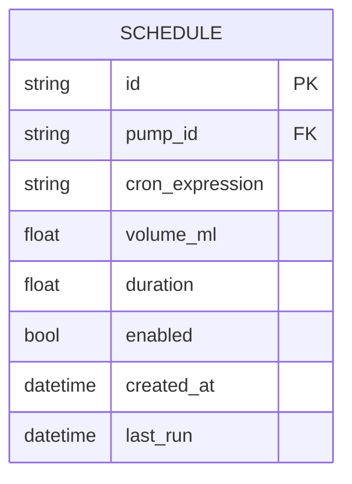

## Frontend UI Elements
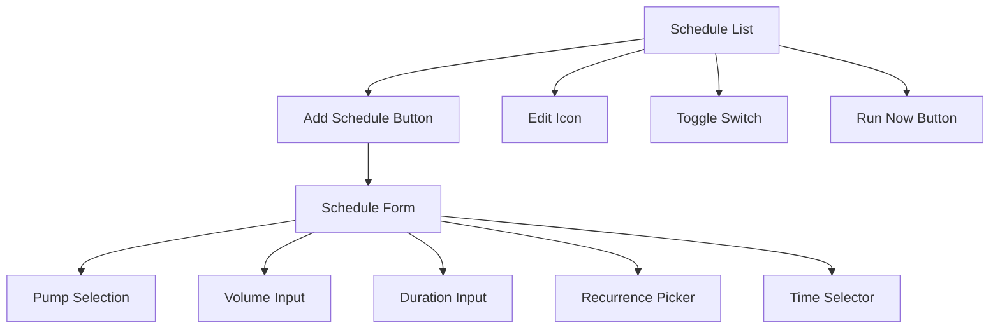
## Execution Guarantees
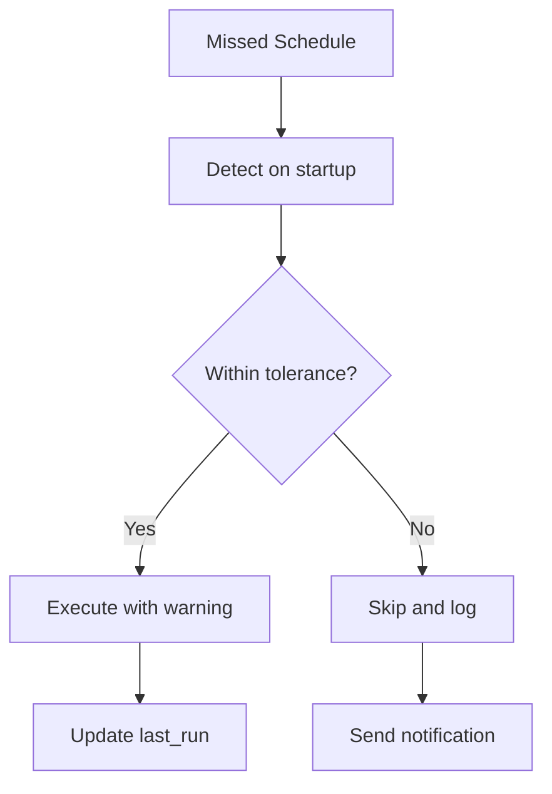

# Testing Strategy

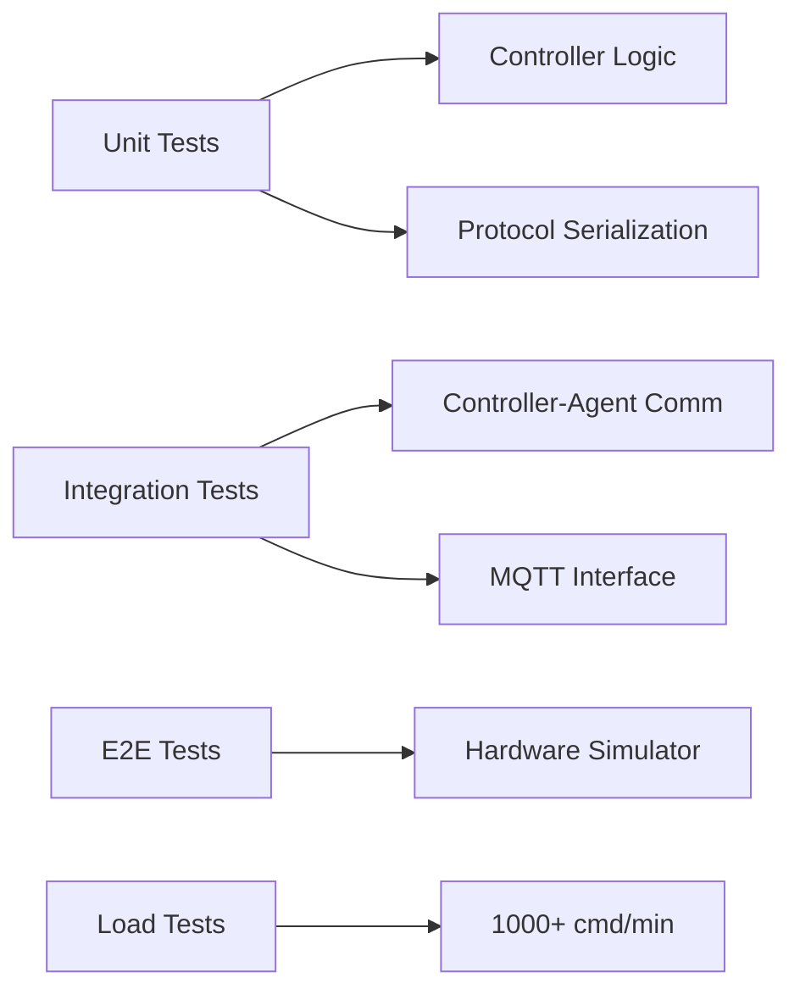

